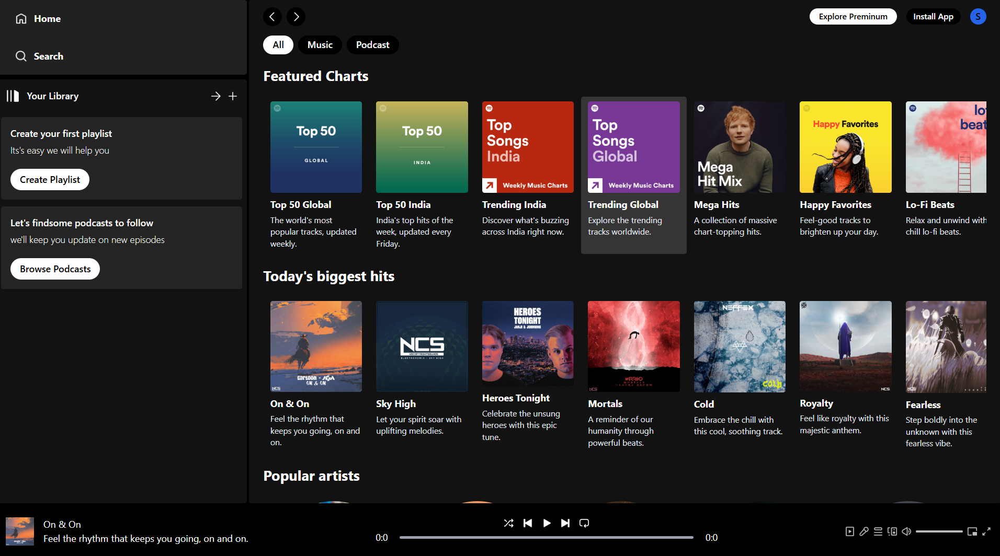
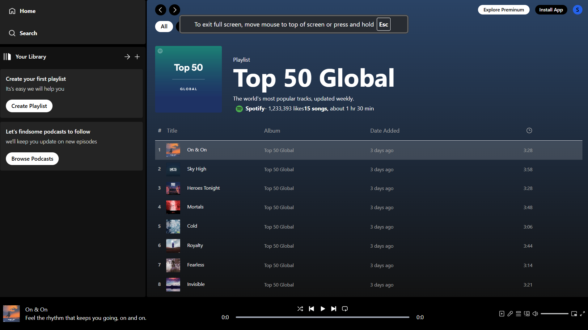

# 🎵 Spotify Clone  

A responsive **Spotify Clone** created using **React (Vite)** and **Tailwind CSS**. This project replicates the look and feel of Spotify's UI with essential features like a Home page and an Album page to display song collections.  

---

## 🌟 Features  

- 🏠 **Home Page**:  
  - Showcases **Albums**, **Songs**, and **Popular Artists** in a clean, organized layout.  

- 💿 **Album Page**:  
  - Displays detailed information about a specific album, including:  
    - **Album Cover Art**  
    - **List of Songs** in the album  
  - Allows users to view and interact with tracks from the selected album.  

- 🎨 **Modern Design**:  
  - Styled with **Tailwind CSS** for a sleek, responsive, and visually appealing experience.  
  - Optimized for mobile, tablet, and desktop devices.  

---

## 🚀 Technologies Used  

- **Frontend**:  
  - ⚛️ React (powered by Vite for fast development)  
  - 🎨 Tailwind CSS for styling  

- **Other Tools**:  
  - 🎵 FontAwesome or custom icons for buttons  
  - ✍️ Google Fonts or Spotify-inspired typography  

---

## 🛠️ Setup and Installation  

1. Clone the repository:  
   ```bash
   git clone https://github.com/SyedShahulAhmed/React-Projects.git
   cd SpotifyClone
   ```  

2. Install dependencies:  
   ```bash
   npm install
   ```  

3. Start the development server:  
   ```bash
   npm run dev
   ```  

4. Open the application in your browser at the provided local URL.  

## 🎨 Screenshots  

### 🏠 Home Page:  
  

### 💿 Album Page:  
  

---

## 🤝 Contributing  

We welcome contributions! Feel free to:  
- 🐞 Report bugs  
- 💡 Submit feature requests  
- 🔄 Fork and create pull requests  

